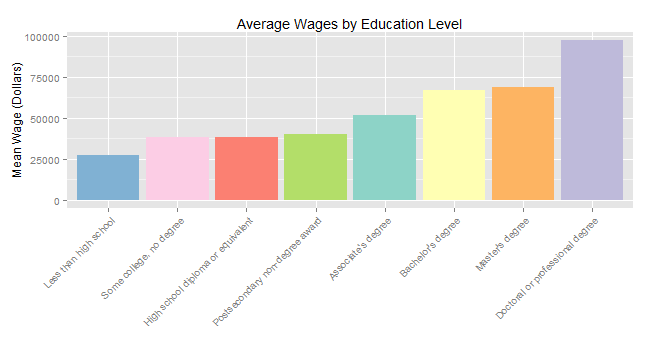

## Top Ten Occupations

---

### Is Education Overrated?

* Does school seem like a drag?
* Ever wonder what job you could get if you quit now?
* What if you like school but don't know what career path to choose.
* How much schooling do I need to make top dollar?

--- .class #id 

### Don't Drop Out.

*  According to the 2012 Labor and Statistics Data there is a 72% difference in wages between high school drop-outs and those with doctoral or professional degrees. 
* Even getting a bachelor's degree improves your earnings by 59%.  

--- .class #id 

### Education Does Pay Off!

 

--- .class #id 

### Check Out the Top Ten Occupations Website for More Information.

### [Top Ten] (https://alc11.shinyapps.io/EmpDataApp)

